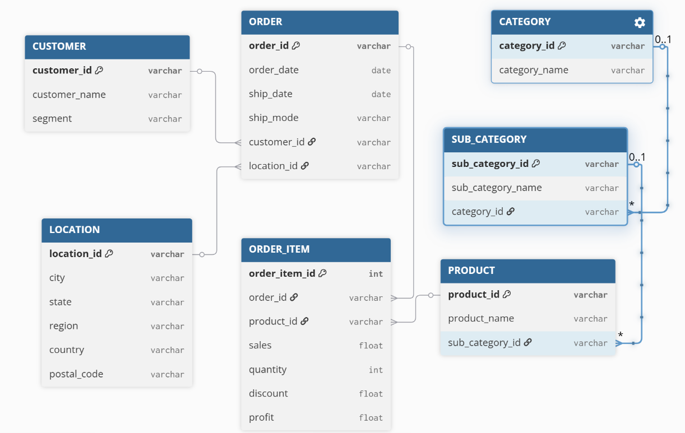

# Superstore Sales — DB Schema Mini-Project

## The Brief

In groups of 2–4, find a dataset online, explore it, and design a normalised database schema. Deliverables were an ERD diagram and a short group presentation.

---

## Dataset

We used the **Superstore Sales** dataset from [Kaggle](https://www.kaggle.com/) — a US retail company's transaction records.

- Raw format: a single flat CSV with 21 columns
- Covered: customers, orders, products, locations, and financials (sales, discount, profit)
- We initially explored a sleep habits dataset but switched to Superstore as it had a richer relational structure
- Key challenge: every piece of information was on one row with no separation between customer, order, product, or location data

---

## Process

### Step 1 — Understand the Data

We examined each column to understand what it represented, identified repeated values, and determined which pieces of data belonged together. No major cleaning was needed.

### Step 2 — Identify Entities

We broke the flat CSV into logical tables, each representing one distinct "thing":

- **Customer** — who placed the order
- **Location** — where it was shipped
- **Order** — the transaction itself
- **Order_Item** — individual product lines within an order
- **Product** — what was sold
- **Sub_Category** — product grouping
- **Category** — top-level product classification

### Step 3 — Define Relationships

We started all relationships as one-to-one as a baseline, then adjusted based on real-world logic:

| Relationship            | Type        |
| ----------------------- | ----------- |
| Customer → Order        | One-to-many |
| Order → Order_Item      | One-to-many |
| Product → Order_Item    | One-to-many |
| Sub_Category → Product  | One-to-many |
| Category → Sub_Category | One-to-many |
| Location → Order        | One-to-many |

### Step 4 — Define Keys

- Each table was given a primary key (PK)
- Foreign keys (FK) were added to link related tables
- `Order` and `Product` had natural PKs already present in the data
- `Location` and `Order_Item` use auto-generated integer IDs (`IDENTITY`)

### Step 5 — Design the Schema

We finalised 7 tables. See the full column definitions in [schema.sql](schema.sql).

### Step 6 — Create the ERD

We built the ERD digitally after starting with a rough hand-drawn version. The diagram was cross-checked with AI to validate the structure.

**ERD walkthrough:**

1. Started with the raw flat data
2. Split into `Order` and `Product` — both had existing PKs in the dataset
3. Connected them with `Order_Item` as a bridge/junction table
4. Branched `Customer` and `Location` off `Order`
5. Branched `Sub_Category` off `Product`, then `Category` off `Sub_Category`

---

## Design Decisions

**Hardest decision: where does each piece of data belong?**

- Financial data (`sales`, `quantity`, `discount`, `profit`) lives in `Order_Item` — not `Order` — because each product line within an order has its own price and discount
- `Location` is a separate table to avoid repeating city, state, and region on every order row
- The `Category → Sub_Category → Product` hierarchy avoids repeating category names on every product row

---

## What We would Improve

- **Returns table** — real retail data would have refunds and returns, which the schema doesn't currently support
- **Shipping table** — courier details, tracking numbers, and delivery status could be tracked separately rather than just storing `ship_mode`
- **Promotions/Discounts table** — `discount` is currently just a float with no context on what promotion caused it
- **Normalise Ship Mode** — currently a free text field, could be its own lookup table to enforce consistency
- **Timestamps** — tracking when records were created or updated would be useful for auditing

---

## Super Bonus

The SQL script to create this schema is in [schema.sql](schema.sql). It creates the `Superstore` database and all 7 tables with correct primary and foreign keys, ready to run in SSMS.
